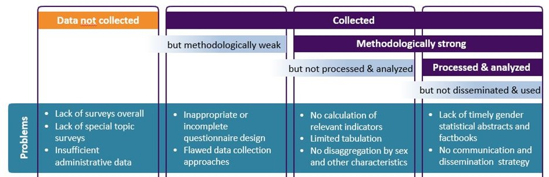

```{r setup, include=FALSE}
knitr::opts_chunk$set(
	echo = FALSE,
	fig.height = 6,
	fig.path = "plots/",
	fig.width = 9,
	message = FALSE,
	warning = FALSE,
	dev = c("png"),
	dpi = 350
)
library(tidyverse)
library(flextable)
library(here)
library(ggthemes)
library(Hmisc)
library(httr)
library(patchwork)
library(ggrepel)
library(haven)
library(zoo)
library(estimatr)
library(ggpmisc)
library(ggthemes)
library(ggtext)
library(fixest)
library(modelsummary)
library(readxl)
#set directories
dir <- here()

raw_dir <- paste(dir, '01_raw_data', sep="/")
output_dir <- paste(dir, '03_output_data', sep="/")

#weights (either unity (1) or population (2))
wgt <- 1

#set data window
window <- 4
upper_year <- 2020
lower_year <- 2020-window

#population filter
pop_filt <- 200000

# rerun the data
rerun=TRUE
cacher=FALSE
```

```{r programs}

FitFlextableToPage <- function(ft, pgwidth = 6){

  ft_out <- ft %>% 
    autofit()

  ft_out <- width(ft_out, width = dim(ft_out)$widths*pgwidth /(flextable_dim(ft_out)$widths))
  return(ft_out)
}

#add equations to plots
eq_plot_txt <- function(data, inp, var, wgt=NULL) {
  eq <- lm_robust(inp ~ var, data=data, se_type='HC2', weights = wgt)
  coef <- round(coef(eq),2)
  std_err <- round(sqrt(diag(vcov(eq))),2)
  r_2<- round(summary(eq)$r.squared,2)
  sprintf("y = %.2f + %.2f x, R<sup>2</sup> = %.2f <br>    (%.2f)   (%.2f)", coef[1], coef[2], r_2[1], std_err[1], std_err[2])

}
```

```{r themes}

#ggplot theme
theme_spi <- function () { 
    theme_bw() %+replace%
    theme(
      plot.caption = element_text(hjust = 0),
      plot.title=element_blank() #remove all titles from plots (sometimes we may need to bring title outside plot)
    )
}

#modelsummary output
gm <- tibble::tribble(
  ~raw,        ~clean,          ~fmt,
  "nobs",      "N",             0,
  "r.squared", "R Sq.", 2)
```


```{r wdi}
# read in archived WDI data from 2023-05-12
# data downloaded from https://datacatalog.worldbank.org/int/search/dataset/0037712/World-Development-Indicators
#version 20

#country metadata
wb_countries <- read_excel(paste0(raw_dir, "/Class.xlsx"), sheet="List of economies") %>%
  transmute(
    iso3c=`Code`,
    country=`Economy`,
    region=`Region`,
    income_level=`Income group`,
    lending_group=`Lending category`
  )

#indicator values
WDI_df <- read_excel(paste0(raw_dir, "/WDIEXCEL.xlsx"))

#keep just the necessary columns and reshape data long
WDI_df <- WDI_df %>%
  filter(
    `Indicator Code` %in% c('SP.POP.TOTL', 'IQ.SPI.OVRL','IQ.SPI.PIL1',
                            'IQ.SPI.PIL2', 'IQ.SPI.PIL3', 'IQ.SPI.PIL4', 'IQ.SPI.PIL5',
                            'NY.GDP.PCAP.PP.CD', 'SP.POP.TOTL',
                            'SG.LAW.INDX','NY.GDP.PCAP.KD',
                            'HD.HCI.OVRL','GE.EST'
                            )
  ) %>%
  rename(iso3c=`Country Code`,
         country=`Country Name`,
         indicator_code=`Indicator Code`,
         ) %>%
  pivot_longer(
    cols=c('1960':'2022'),
    names_to = 'date',
    values_to = 'value'
  ) %>%
  mutate(date=as.numeric(date)) %>%
  select(-`Indicator Name`) %>%
  pivot_wider(names_from='indicator_code',
              values_from = 'value') %>%
  filter(date>=2004)


```


```{r popcutoff}

#This code reads in some population data to create a set of countries that have a population above a threshold.


#get a list of countries that are below the population limit defined at to of script
pop_exlude_cntry <- WDI_df %>% filter(date==2021) %>% filter(SP.POP.TOTL <= pop_filt) %>% select(iso3c) %>% pluck(1)
pop_exlude_cntry_names <- WDI_df %>% left_join(wb_countries) %>% filter(date==2021) %>% filter(SP.POP.TOTL <= pop_filt) %>% select(country) %>% pluck(1)

```

```{r sdgbackground}

#this code reads in some background files about specific SDG indicators related to Gender.  These files include metadata used in the analysis.

#read in table about gender sdgs
sdg_tab <- read_csv(file = paste0(raw_dir, '/misc/Gender_SDGs.csv')) 

sdg_tab_merge <- sdg_tab %>%
  #filter(!is.na(Code)) %>%
  transmute(ccode=ccode,
            code1=Code,
            code=SDG,
            Gender_Breakdown=Gender_Breakdown)

#get a list of all SDG indicators
indicators_url <- paste0(raw_dir, '/misc/un_indicators.json')

indicators_list <- sdg_tab %>%
  filter(!is.na(Code))

indicators_list <- indicators_list$Code


#bring in the list of indicators
list_df <- jsonlite::fromJSON(indicators_url, flatten = TRUE) %>%
  as_tibble() %>%
  unnest(keep_empty = TRUE)

list_df <- sdg_tab_merge %>%
  left_join(list_df) %>%
  filter(!is.na(ccode)) 

# get list of tier 1 indicaors
tier1_list <- list_df %>%
  filter(tier==1)

tier1_list <- tier1_list$code1

# get list of tier 2 indicaors
tier2_list <- list_df %>%
  filter(tier==2)

tier2_list <- tier2_list$code1

#get goal
sdg_tab$Goal <- as.character(map(strsplit(sdg_tab$SDG, split = "\\."), 1))

#get a table with this metadata formatted
table1dat <- list_df %>%
   transmute(
    ccode=ccode,
    Goal=goal,
    Indicator=code,
    Description=description,
    Tier=tier,
    `Sub-Description`=description1,
    Gender_Breakdown=Gender_Breakdown
  ) %>%
  group_by(ccode, Goal, Indicator, Description, Tier, Gender_Breakdown) %>%
  summarise(`Sub-Indicators`=paste(`Sub-Description`,collapse="; /n ")) %>%
  distinct() %>%
  select(-ccode)
```


```{r sdgtotal}

# get totals for all SDGs
all_sdg_df <- read_csv(paste0(raw_dir, "/SPI_D3_UNSD_alltier_data_5yr.csv")) %>%
  filter(date==upper_year) %>%
  filter(!(iso3c %in% pop_exlude_cntry)) %>%
    #collapse to country level
  group_by(iso3c, country) %>%
  summarise(
    availability=wtd.mean(ind_quality, weight=ind_number)
  ) 

global_availability <- mean(all_sdg_df$availability)

# get totals for all SDGs
all_gender_sdg_df <- read_csv(paste0(raw_dir, "/SPI_D3_UNSD_gender_data_5yr.csv")) %>%
  filter(date==upper_year) %>%
  filter(!(iso3c %in% pop_exlude_cntry)) %>%
    #collapse to country level
  group_by(iso3c, country, goal) %>%
  summarise(
    availability=wtd.mean(ind_quality, weight=ind_number)
  ) 

global_gender_availability <- mean(all_gender_sdg_df$availability)

# get totals for all SDGs
all_nongender_sdg_df <- read_csv(paste0(raw_dir, "/SPI_D3_UNSD_nongender_data_5yr.csv")) %>%
  filter(date==upper_year) %>%
  filter(!(iso3c %in% pop_exlude_cntry)) %>%
    #collapse to country level
  group_by(iso3c, country, goal) %>%
  summarise(
    availability=wtd.mean(ind_quality, weight=ind_number)
  ) 

global_nongender_availability <- mean(all_nongender_sdg_df$availability)
  
```

```{r save, echo=FALSE, message=FALSE, warning=FALSE, show_col_types = FALSE, cache=cacher}

#This code chunk loops through all 50 SDGs related to gender, reads in data from UN SDG database, and appends the files together.  Each country by year observation has a score for whether or not an SDG indicator is available.
#read in sdg data and save
country_metadata <- wb_countries %>%
  filter(!is.na(region))

#remove this dataframe if it exists
if (exists('un_sdg_df')) {
  rm(un_sdg_df)
}

for (series in list_df$code1) {
    
  #read in files
  if (file.exists(paste(raw_dir,'/sdg_data/',series,'.csv',sep=""))) {
    temp <- read_csv(paste(raw_dir,'/sdg_data/',series,'.csv',sep="")) %>%
      mutate(
        date=as.numeric(date), 
        goal=as.character(goal), 
        target=as.character(target), 
        code==as.character(code), 
        code1=as.character(code1), 
        description1=as.character(description1)
      )
    
    #   #now append it to the overall database
    if (!exists('un_sdg_df')) {
      un_sdg_df <- temp
    } else if (exists('un_sdg_df')) {
      un_sdg_df <- un_sdg_df %>%
        bind_rows(temp)
    }
  }
  
}

#remove this dataframe if it exists
if (exists('un_sdg_meta')) {
  rm(un_sdg_meta)
}

for (series in list_df$code1) {
    
  #read in files
  if (file.exists(paste(raw_dir,'/sdg_data/',series,'.csv',sep=""))) {
   
    tempmeta <- read_csv(paste(raw_dir,'/sdg_data/',series,'.csv',sep="")) %>%
    filter(!is.na(ind_value)) %>%
    group_by(ind_metadata, code1) %>%
    summarise(n = n()) %>%
    ungroup() %>%
    mutate(tot = sum(n),
           source_share = round(100*n/tot, 1),
           ind_metadata=as.character(ind_metadata))
    
    #   #now append it to the overall database
    if (!exists('un_sdg_meta')) {
      un_sdg_meta <- tempmeta
    } else if (exists('un_sdg_meta')) {
      un_sdg_meta <- un_sdg_meta %>%
        bind_rows(tempmeta)
    }
  }
  
}

 un_sdg_meta_wide <- un_sdg_meta %>%
  filter(!is.na(ind_metadata)) %>%
   group_by(code1, ind_metadata) %>%
   summarise(source_share = mean(source_share)) %>%
   spread(ind_metadata, source_share) %>%
   mutate_all(as.character) %>%
  mutate(source_share = paste0("C: (", C, "), CA: (", CA, "), E: (", E, "), G: (", G, "), M: (", M, ")"),
         source_share = gsub("NA", "", source_share)) %>%
   select(code1, source_share)
  

#read in OECD data for updates based on OECD database
oecd_df <- read_csv(paste(raw_dir,'/oecd_data/OECD_data_scored.csv', sep=""))

un_sdg_df <- un_sdg_df %>%
  mutate(goal=as.numeric(goal)) %>%
  left_join(oecd_df) %>%
  mutate(goal=as.character(goal)) %>%
  mutate(ind_quality=if_else(ind_quality.oecd>ind_quality,ind_quality.oecd,ind_quality, ind_quality )) #replace value with OECD value if it exists

#save the data file
  
un_sdg_df<- un_sdg_df %>%
    left_join(sdg_tab_merge)  #merge on special code for aggregating 


write_excel_csv(un_sdg_df, paste(output_dir, '/un_sdg_df.csv',sep=""))

```

```{r readgender, echo=FALSE, show_col_types=FALSE, cache=cacher}

#this chunk does the same as the above, except it looks at whether the indicator has a gender breakdown available

#remove this dataframe if it exists
if (exists('un_sdg_gender_df')) {
  rm(un_sdg_gender_df)
}

for (series in list_df$code1) {
    
  #read in files
  if (file.exists(paste(raw_dir,'/sdg_data/',series,'_sex_disagg.csv',sep=""))) {
    temp <- read_csv(paste(raw_dir,'/sdg_data/',series,'_sex_disagg.csv',sep="")) %>%
      mutate(
        date=as.numeric(date), 
        goal=as.character(goal), 
        target=as.character(target), 
        code==as.character(code), 
        code1=as.character(code1), 
        description1=as.character(description1)
      )
    
    #   #now append it to the overall database
    if (!exists('un_sdg_gender_df')) {
      un_sdg_gender_df <- temp
    } else if (exists('un_sdg_gender_df')) {
      un_sdg_gender_df <- un_sdg_gender_df %>%
        bind_rows(temp)
    }
  }
  
}


un_sdg_gender_df <- un_sdg_gender_df %>%
  left_join(sdg_tab_merge) #add in special codes for grouping indicators (ccode)


#save the data file
  
write_excel_csv(un_sdg_gender_df, paste(output_dir, '/un_sdg_gender_disagg_df.csv',sep=""))


```

```{r gender_shape, cache=cacher}


span <- c(2004:2020)

####
#create two empty datasets to merge onto
####

#read list of iso3c codes for matching from UN (https://unstats.un.org/unsd/methodology/m49/)
iso3c <- read_csv(paste(raw_dir,'metadata/iso_codes.csv', sep="/"),
                  col_types=list(col_character(), col_character(), col_character())) %>%
  select(iso3c) %>%
  left_join(wb_countries) %>%
  filter(!is.na(region))


# start by creating empty dataset with country by year
gender_df_empty <- bind_rows(replicate(length(span), iso3c, simplify = FALSE), .id='date') %>%
  mutate(date=as.numeric(date)+span[1]-1) %>%
  filter(!is.na(region)) %>% # take out the aggregates (LAC, SAR, etc)
  select(iso3c, date)

#now append to get country by year by series
gender_sdg_df_empty <- map_dfr(list_df$code1, ~(gender_df_empty %>% mutate(code1=.x)))

#do the same for the gender disaggregated data
gender_disagg_empty <- gender_df_empty %>% mutate(sex='FEMALE') %>%
  bind_rows(gender_df_empty %>% mutate(sex='MALE')) %>%
  bind_rows(gender_df_empty %>% mutate(sex='BOTHSEX')) 

gender_disagg_sdg_df_empty <- map_dfr(list_df$code1, ~(gender_disagg_empty %>% mutate(code1=.x)))


#create database of gender indicators whether they exist at all
  un_sdg_filled_df <-  gender_sdg_df_empty %>%
    left_join(sdg_tab_merge %>% filter(!is.na(code1))) %>% #add ccode for specialized indicator grouping
    left_join(un_sdg_df) %>%
    filter(!is.na(Gender_Breakdown)) %>%
  mutate(ind_quality=if_else(is.na(ind_quality), 0,ind_quality))
  
    

#create database of gender indicators disaggregated by sex

  un_sdg_gender_filled_df <-  gender_disagg_sdg_df_empty %>%
    left_join(sdg_tab_merge %>% filter(!is.na(code1)))  %>% #add ccode for specialized indicator grouping
    left_join(un_sdg_gender_df) %>%
    filter(!is.na(Gender_Breakdown)) %>%
    mutate(ind_quality=if_else(is.na(ind_quality), 0,ind_quality))
  
  
  
```

```{r combinedfile}

# in this file a new database is created, where countries are evaluated if there is an indicator with a female value when a breakdown is called for and any indicator at all when no sex diasggregation is called for

un_sdg_combined_df <- un_sdg_filled_df %>%
  filter(Gender_Breakdown==0)  #keep just the indicators that don't call for a gender breakdown


#now bring in the indicators requiring gender breakdown
temp_gender_df <- un_sdg_gender_filled_df %>%
  filter(Gender_Breakdown==1) %>% #keep just the indicators that do call for a gender breakdown
  filter(sex=="FEMALE" ) 

#add in the gender breakdown
un_sdg_combined_df <- un_sdg_combined_df %>%
  bind_rows(temp_gender_df)  #give countries 0 if no indicator, otherwise scored based on quality of indicator

write_excel_csv(un_sdg_combined_df, paste(output_dir, '/un_sdg_combined_df.csv',sep=""))

```

```{r saver, include=rerun, cache=cacher}

#get a count by goal of the number of indicators
sdg_count <- sdg_tab %>%
  group_by(Goal, ccode) %>%
  summarise(n=n()) %>%
  group_by(Goal) %>%
  summarise(goal_count=n()) %>%
  rename(goal=Goal)

#function to create scored data

un_aki_fun <- function(date_start, date_end) {
  
  global <- un_sdg_combined_df %>%
    filter(between(date,date_start,date_end) ) %>%
    filter(!is.na(ind_quality)) %>%
    group_by(iso3c, ccode) %>%
    summarise(ind_quality=max(ind_quality, na.rm=T),
              ind_value=mean(ind_value, na.rm=T),
              ind_metadata=first(ind_metadata)) %>% #check if any values (even sub-indicators) for indicator
      mutate(ind_quality=if_else(is.na(ind_quality),0,ind_quality)) %>% # if the indicator is missing for a year in the database, set availability to 0.
      group_by(iso3c) %>%
      summarise(ind_quality=round(sum(ind_quality)/50,3),
                goal_count=50,
                ind_number=n() #get whether indicator exists at all in 5 years of this across countries
              ) %>%
    left_join(country_metadata) %>%
    filter(!is.na(region)) %>%
    select(iso3c, country,region, income_level, ind_quality,ind_number,goal_count) %>%
    mutate(date=date_end,
           goal="Combined")
  
    tier1 <- un_sdg_combined_df %>%
      filter(between(date,date_start,date_end) ) %>%
      filter(!is.na(ind_quality)) %>%
      filter(code1 %in% tier1_list) %>% #get just tier1 indicators  
      group_by(iso3c, ccode) %>%
      summarise(ind_quality=max(ind_quality, na.rm=T),
                ind_value=mean(ind_value, na.rm=T),
                ind_metadata=first(ind_metadata)) %>% #check if any values (even sub-indicators) for indicator
        mutate(ind_quality=if_else(is.na(ind_quality),0,ind_quality)) %>% # if the indicator is missing for a year in the database, set availability to 0.
        group_by(iso3c) %>%
        summarise(ind_quality=round(sum(ind_quality)/18,3),
                goal_count=18,
                ind_number=n() #get whether indicator exists at all in 5 years of this across countries
                ) %>%
      left_join(country_metadata) %>%
      filter(!is.na(region)) %>%
      select(iso3c, country,region, income_level, ind_quality,ind_number,goal_count) %>%
      mutate(date=date_end,
             goal="Tier 1")
    
    tier2 <- un_sdg_combined_df %>%
      filter(between(date,date_start,date_end) ) %>%
      filter(!is.na(ind_quality)) %>%
      filter(code1 %in% tier2_list) %>% #get just tier1 indicators  
      group_by(iso3c, ccode) %>%
      summarise(ind_quality=max(ind_quality, na.rm=T),
                ind_value=mean(ind_value, na.rm=T),
                ind_metadata=first(ind_metadata)) %>% #check if any values (even sub-indicators) for indicator
        mutate(ind_quality=if_else(is.na(ind_quality),0,ind_quality)) %>% # if the indicator is missing for a year in the database, set availability to 0.
        group_by(iso3c) %>%
        summarise(ind_quality=round(sum(ind_quality)/32,3),
                goal_count=32,
                ind_number=n() #get whether indicator exists at all in 5 years of this across countries
                ) %>%
      left_join(country_metadata) %>%
      filter(!is.na(region)) %>%
      select(iso3c, country,region, income_level, ind_quality,ind_number,goal_count) %>%
      mutate(date=date_end,
             goal="Tier 2")
    
    #1)	Can you re-compute Gender SDG coverage overall and for the 4 country income groups  (5 new stats) if you drop the top 5 DHS/MICS indicators 
    # (so for 45 Gender SDGs):  16.2.3 5.3.1 5.6.1 4.2.1 5.3.2
    top5_dhs_mics_list <- c('VC_VAW_SXVLN','SP_DYN_MRBF18', 'SP_DYN_MRBF15', 'SH_FPL_INFM', 'SE_DEV_ONTRK', 'SH_STA_FGMS')
    top5_dhs_mics <- un_sdg_combined_df %>%
      filter(between(date,date_start,date_end) ) %>%
      filter(!is.na(ind_quality)) %>%
      filter(!(code1 %in% top5_dhs_mics_list)) %>% #get just tier1 indicators  
      group_by(iso3c, ccode) %>%
      summarise(ind_quality=max(ind_quality, na.rm=T),
                ind_value=mean(ind_value, na.rm=T),
                ind_metadata=first(ind_metadata)) %>% #check if any values (even sub-indicators) for indicator
        mutate(ind_quality=if_else(is.na(ind_quality),0,ind_quality)) %>% # if the indicator is missing for a year in the database, set availability to 0.
        group_by(iso3c) %>%
        summarise(ind_quality=round(sum(ind_quality)/45,3),
                goal_count=45,
                ind_number=n() #get whether indicator exists at all in 5 years of this across countries
                ) %>%
      left_join(country_metadata) %>%
      filter(!is.na(region)) %>%
      select(iso3c, country,region, income_level, ind_quality,ind_number,goal_count) %>%
      mutate(date=date_end,
             goal="Top 5 DHS/MICS Dropped")
    
    # 2)	again, if you drop the top 7 (so for 43 Gender SDGs)
    # (so for 45 Gender SDGs):  4.5.1 3.7.1 16.2.3 5.3.1 5.6.1 4.2.1 5.3.2
    top7_dhs_mics_list <- c('SE_TOT_GPI','SE_TOT_GPI_FS','SE_AGP_CPRA', 'SE_GPI_PART', 'SE_GPI_PTNPRE', 'SE_GPI_TCAQ','SE_GPI_ICTS', 'SH_FPL_MTMM', 'VC_VAW_SXVLN','SP_DYN_MRBF18', 'SP_DYN_MRBF15', 'SH_FPL_INFM', 'SE_DEV_ONTRK', 'SH_STA_FGMS')
    top7_dhs_mics <- un_sdg_combined_df %>%
      filter(between(date,date_start,date_end) ) %>%
      filter(!is.na(ind_quality)) %>%
      filter(!(code1 %in% top7_dhs_mics_list)) %>% #get just tier1 indicators  
      group_by(iso3c, ccode) %>%
      summarise(ind_quality=max(ind_quality, na.rm=T),
                ind_value=mean(ind_value, na.rm=T),
                ind_metadata=first(ind_metadata)) %>% #check if any values (even sub-indicators) for indicator
        mutate(ind_quality=if_else(is.na(ind_quality),0,ind_quality)) %>% # if the indicator is missing for a year in the database, set availability to 0.
        group_by(iso3c) %>%
        summarise(ind_quality=round(sum(ind_quality)/43,3),
                goal_count=43,
                ind_number=n() #get whether indicator exists at all in 5 years of this across countries
                ) %>%
      left_join(country_metadata) %>%
      filter(!is.na(region)) %>%
      select(iso3c, country,region, income_level, ind_quality,ind_number,goal_count) %>%
      mutate(date=date_end,
             goal="Top 7 DHS/MICS Dropped")
    

  goal <- un_sdg_combined_df %>%
    filter(between(date,date_start,date_end) ) %>%
    filter(!is.na(ind_quality)) %>%
    group_by(iso3c, ccode) %>%
    summarise(ind_quality=max(ind_quality, na.rm=T),
              ind_value=mean(ind_value, na.rm=T),
              ind_metadata=first(ind_metadata)) %>% #check if any values (even sub-indicators) for indicator
    mutate(ind_quality=if_else(is.na(ind_quality),0,ind_quality)) %>% # if the indicator is missing for a year in the database, set availability to 0.
    left_join(list_df %>% group_by(ccode,code, goal) %>% summarise(num=n())) %>%
    left_join(sdg_count) %>%
    ungroup() %>%
    group_by(iso3c,goal) %>%
    summarise(ind_quality=round(sum(ind_quality)/mean(goal_count),3),
              goal_count=mean(goal_count),
              ind_number=n() #get whether indicator exists at all in 5 years of this across countries
              ) %>%
    left_join(country_metadata) %>%
    filter(!is.na(region)) %>%
    select(iso3c, country,region, income_level,goal, ind_quality,ind_number, goal_count) %>%
    mutate(date=date_end
    ) 

   
  global %>%
    bind_rows(tier1) %>%
    bind_rows(tier2) %>%
    bind_rows(goal) %>%
    bind_rows(top5_dhs_mics) %>%
    bind_rows(top7_dhs_mics) %>%
    select(iso3c,date, country,region, income_level,goal, ind_quality, ind_number,goal_count)
  
}


####
# 10 Year window
####
#create this database for each year from 2004 to 2020 using a 5 year average
for (i in c(2009:2020)) {
  
  start=i-9
  end=i
  
  temp_df <- un_aki_fun(start,end)
  assign(paste('un_aki_',end, sep=""), temp_df)
}

if (exists('un_aki')) {
  rm('un_aki')
}
#now append together and save
for (i in c(2009:2020)) {
  
  temp<-get(paste('un_aki_',i, sep=""))
  
  if (!exists('un_aki')) {
    un_aki<-temp 
  } else {
    un_aki<-un_aki %>%
      bind_rows(temp) %>%
      arrange(-date, iso3c)
  }
}

write_excel_csv(un_aki, path=paste(output_dir, 'SPI_Gender_UNSD_data_10yr.csv', sep="/"))

####
# 8 Year window
####
#create this database for each year from 2004 to 2020 using a 5 year average
for (i in c(2007:2020)) {
  
  start=i-7
  end=i
  
  temp_df <- un_aki_fun(start,end)
  assign(paste('un_aki_',end, sep=""), temp_df)
}

if (exists('un_aki')) {
  rm('un_aki')
}
#now append together and save
for (i in c(2007:2020)) {
  
  temp<-get(paste('un_aki_',i, sep=""))
  
  if (!exists('un_aki')) {
    un_aki<-temp
  } else {
    un_aki<-un_aki %>%
      bind_rows(temp) %>%
      arrange(-date, iso3c)
  }
}

write_excel_csv(un_aki, path=paste(output_dir, 'SPI_Gender_UNSD_data_8yr.csv', sep="/"))

####
# 5 Year window
####
#create this database for each year from 2004 to 2020 using a 5 year average
for (i in c(2004:2020)) {
  
  start=i-window
  end=i
  
  temp_df <- un_aki_fun(start,end)
  assign(paste('un_aki_',end, sep=""), temp_df)
}

if (exists('un_aki')) {
  rm('un_aki')
}
#now append together and save
for (i in c(2004:2020)) {
  
  temp<-get(paste('un_aki_',i, sep=""))
  
  if (!exists('un_aki')) {
    un_aki<-temp
  } else {
    un_aki<-un_aki %>%
      bind_rows(temp) %>%
      arrange(-date, iso3c)
  }
}
write_excel_csv(un_aki, path=paste(output_dir, 'SPI_Gender_UNSD_data_5yr.csv', sep="/"))

####
# 3 Year window
####
#create this database for each year from 2004 to 2020 using a 5 year average
for (i in c(2004:2020)) {
  
  start=i-2
  end=i
  
  temp_df <- un_aki_fun(start,end)
  assign(paste('un_aki_',end, sep=""), temp_df)
}

if (exists('un_aki')) {
  rm('un_aki')
}
#now append together and save
for (i in c(2004:2020)) {
  
  temp<-get(paste('un_aki_',i, sep=""))
  
  if (!exists('un_aki')) {
    un_aki<-temp
  } else {
    un_aki<-un_aki %>%
      bind_rows(temp) %>%
      arrange(-date, iso3c)
  }
}

write_excel_csv(un_aki, paste(output_dir, 'SPI_Gender_UNSD_data_3yr.csv', sep="/"))

####
# 1 Year window
####
#create this database for each year from 2004 to 2020 using a 5 year average
for (i in c(2004:2020)) {
  
  start=i-0
  end=i
  
  temp_df <- un_aki_fun(start,end)
  assign(paste('un_aki_',end, sep=""), temp_df)
}

if (exists('un_aki')) {
  rm('un_aki')
}
#now append together and save
for (i in c(2004:2020)) {
  
  temp<-get(paste('un_aki_',i, sep=""))
  
  if (!exists('un_aki')) {
    un_aki<-temp
  } else {
    un_aki<-un_aki %>%
      bind_rows(temp) %>%
      arrange(-date, iso3c)
  }
}

write_excel_csv(un_aki, path=paste(output_dir, 'SPI_Gender_UNSD_data_1yr.csv', sep="/"))

```


```{r corrdf, include=FALSE}
# get correlation analysis data prepared

#get overall gender data availability measure
avail_SPI_df <- read_csv(paste0(output_dir, '/SPI_Gender_UNSD_data_5yr.csv')) %>%   filter(!(iso3c %in% pop_exlude_cntry)) %>%
  mutate(availability=100*ind_quality) %>% #convert ind_quality measure which is 0-1 to percentage available by multiplying by 100
  filter(date==2019 & goal=="Combined") #keep just most recent year

#read in SPI data from WDI
SPI_df <- WDI_df %>%
  filter(date==2019) %>%
  select(iso3c, c('IQ.SPI.OVRL','IQ.SPI.PIL1', 'IQ.SPI.PIL2', 'IQ.SPI.PIL3', 'IQ.SPI.PIL4', 'IQ.SPI.PIL5',
                                       'NY.GDP.PCAP.PP.CD', 'SP.POP.TOTL',
                                       'SG.LAW.INDX','NY.GDP.PCAP.KD',
                                       'HD.HCI.OVRL','GE.EST'))


#read in data on  GII and SIGI measures 
gii_sigi_df <- readxl::read_excel(paste0(raw_dir, "/misc/GII_SIGI.xlsx")) %>%
  rename(country=Country,
         gii=`GII 2021`,
         sigi=`SIGI 2019`)


#combine data
avail_wbstats_df <- avail_SPI_df %>%
  left_join(gii_sigi_df) %>%
  left_join(SPI_df) %>%
  mutate(outcome=IQ.SPI.OVRL,
         value=availability)

combined_df <- avail_wbstats_df 

combined_df_sv <- combined_df %>%
  select(iso3c, country, region, income_level, IQ.SPI.OVRL, availability, IQ.SPI.PIL3, NY.GDP.PCAP.PP.CD, SP.POP.TOTL,HD.HCI.OVRL,GE.EST,SG.LAW.INDX,gii,sigi,NY.GDP.PCAP.KD) %>%
  rename_with(~gsub(".","_",.x, fixed=TRUE)) 

var.labels = c(IQ_SPI_OVRL="SPI Overall Score", 
               availability='Gender SDG Availability', 
               IQ_SPI_PIL3 = "Overall SDG Availability (SPI Pillar 3)", 
               NY_GDP_PCAP_PP_CD = "GDP per capita, PPP (current international $)", 
               SP_POP_TOTL='Total Population',
               HD_HCI_OVRL = 'Human Capital Index',
               GE_EST = "WGI: Governance Effectiveness",
               SG_LAW_INDX = "Women, Business, and Law",
               gii ="GII",
               sigi="SIGI",
               NY_GDP_PCAP_KD="GDP per capita (constant 2015 US$)")

label(combined_df_sv) = as.list(var.labels[match(names(combined_df_sv), names(var.labels))])

label(combined_df_sv)

combined_df %>%
  write_excel_csv(path=paste0(output_dir, '/SPI_Gender_SDG_data.csv'))

haven::write_dta(combined_df_sv, path=paste0(output_dir, '/SPI_Gender_SDG_data.dta'))


```

# Main Tables and Figures

## Figure 1: Sources of gender data gaps 

Figure produced using Microsoft Powerpoint.



Source: Bonfert et al. 2022

## Figure 2. Availability of SDG5 gender-related indicators (N=181 countries)

Published figure produced using Microsoft Excel.  See the file Fig2 SDG5 coverage.xlsx.

Data for excel figure produced below.

```{r fig2dat}

avail_plt_df5 <- read_csv(paste0(output_dir, '/SPI_Gender_UNSD_data_5yr.csv')) %>%   filter(!(iso3c %in% pop_exlude_cntry)) %>%
  mutate(availability=100*ind_quality) %>% #convert ind_quality measure which is 0-1 to percentage available by multiplying by 100
  filter(date==2020 & goal=="5") #keep just most recent year

```

```{r fig2}

fig2_df <- avail_plt_df5 %>%
  mutate(count=round(ind_quality*goal_count,0)) %>%
  group_by(count) %>%
  summarise(n=n()) %>%
  mutate(share=n/sum(n))

fig2_df

```

## Figure 3. Availability of SDG gender indicators by region (N=181 countries) 


```{r availabilitydat}


avail_plt_df <- read_csv(paste0(output_dir, '/SPI_Gender_UNSD_data_5yr.csv')) %>%
  filter(!(iso3c %in% pop_exlude_cntry)) %>%
  mutate(availability=100*ind_quality) %>% #convert ind_quality measure which is 0-1 to percentage available by multiplying by 100
  filter(date==2020 & goal=="Combined") %>% #keep just most recent year
  left_join(WDI_df) %>%
  mutate(income_alt_groups=case_when(
    income_level=="High income" & SP.POP.TOTL<=500000 ~ "Hgh Income & Pop <= 500K",
    income_level=="High income" & SP.POP.TOTL>500000 ~ "Hgh Income & Pop >= 500K",
    TRUE ~ income_level
  ),
  pop_groups=case_when(
    SP.POP.TOTL<=500000 ~ "Pop <= 500K",
    SP.POP.TOTL>500000 ~ "Pop > 500K",
  ) )


avail_plt_df %>%
  write_excel_csv(paste0(output_dir, '/SPI_Gender_availability_inc_reg_pop.csv'))

```


```{r avail_chart1}

#calculate global average
world_avg <-
  avail_plt_df %>%
  summarise(avg = mean(availability, na.rm = T)) %>%
  pull(avg)

world_p25 <- scales::comma(quantile(avail_plt_df$availability, p=0.25, na.rm=TRUE))
world_p50 <- scales::comma(quantile(avail_plt_df$availability, p=0.5, na.rm=TRUE))
world_p75 <- scales::comma(quantile(avail_plt_df$availability, p=0.75, na.rm=TRUE))

#calculate regional average
reg_avg <-
  avail_plt_df %>%
  filter(!is.na(region)) %>%
  group_by(region) %>%
  summarise(avg = mean(availability, na.rm = T)) %>%
  arrange(-avg) 

reg_avg <- reg_avg %>%
    mutate(region=factor(region, levels=reg_avg$region)) 


#set annotatino arrows
arrows <-
  tibble(
    x1 = c(5.2, 6.62),
    x2 = c(4.6, 7),
    y1 = c(world_avg + 20, 15),
    y2 = c(world_avg + 2, 21)
  )


avail_plt_df %>%
  filter(!is.na(region)) %>%
  mutate(region=factor(region, levels=reg_avg$region)) %>%
  ggplot(aes(y=availability, x=region,  color=region)) +
  geom_segment(
    data=reg_avg,
    aes(x = region, xend = region,
        y = world_avg, yend = avg),
    size = 0.8
  ) +
  #geom_boxplot(aes(color=region), outlier.alpha = 0) +
  geom_jitter(aes(size = SP.POP.TOTL), alpha = 0.25, width = 0.2) +
  #geom_point(size = 3, alpha = 0.15) +
  #stat_summary(fun = mean, geom = "text", size = 5, color='black') +
  geom_text(data=reg_avg, aes(y=avg, x=region, label=scales::comma(round(avg,1))), color="black", position=position_dodge()) +
  geom_hline(aes(yintercept = world_avg), color = "gray70", size = 0.6) +
  labs(caption=str_wrap(paste0("The 25th percentile of the SDG gender availability is ",world_p25,"%. The median is ",world_p50,"% and the 75th percentile is ",world_p75,"%.",' Means are unweighted.  Circles are sized according to population'),120)) +
  theme_bw() +
  coord_flip() +
  ylab('SDG Gender Indicator Availability') +
  # scale_y_continuous(
  #   labels=scales::comma
  # ) +
  # scale_y_log10(
  #   labels=scales::comma
  # ) +
  expand_limits(y=c(0,100)) +
  theme(
    legend.position = 'none',
    axis.title.y = element_blank(),
    text = element_text(size=14) 
  ) +
  annotate( #annotations
    "text", x = 5.5, y = 60, family = "Poppins", size = 4, color = "gray20", lineheight = .9,
    label = glue::glue("Average across all countries:\n{round(world_avg, 1)}%")
  ) +
  annotate(
    "text", x = 6.5, y = 7, family = "Poppins", size = 4, color = "gray20",
    label = str_wrap("Regional average",15)
  ) +
  geom_curve( #add curves for annotatino
    data = arrows, aes(x = x1, y = y1, xend = x2, yend = y2),
    arrow = arrow(length = unit(0.08, "inch")), size = 0.5,
    color = "gray20", curvature = -0.3
  )

#reg_avg %>% flextable()

```

## Figure 4. Availability of SDG gender indicators by income group (N=181 countries)

```{r avail_chart11}

#calculate regional average
inc_avg <-
  avail_plt_df %>%
  #mutate(income_level = ifelse(iso3c == "VEN", "Upper middle income", income_level)) %>%
  filter(!is.na(income_level) & income_level != "Not classified") %>%
  group_by(income_level) %>%
  summarise(avg = mean(availability, na.rm = T)) %>%
  arrange(-avg) %>%
  ungroup()                                        

avail_plt_df <- avail_plt_df %>%
    mutate(income_level=factor(income_level, levels= c("High income", "Upper middle income", 
                                                       "Lower middle income", "Low income"))) 
#set annotatino arrows
arrows <-
  tibble(
    x1 = c(3.2, 1.5),
    x2 = c(2.5, 1.15),
    y1 = c(world_avg + 20, 20),
    y2 = c(world_avg + 2, 31)
  )

avail_plt_df %>%
  filter(!is.na(income_level)) %>%
  mutate(income_level=ordered(income_level, levels=c("High income", "Upper middle income", 
                                                       "Lower middle income", "Low income"))) %>%
  arrange(income_level) %>%
  ggplot(aes(y=availability, x=income_level,
             color=income_level)) +
  geom_segment(
    data=inc_avg,
    aes(x = income_level, xend = income_level,
        y = world_avg, yend = avg),
    size = 0.8
  ) +
  #geom_boxplot(aes(color=region), outlier.alpha = 0) +
  geom_jitter(aes(size = SP.POP.TOTL), alpha = 0.25, width = 0.2) +
  #geom_point(size = 3, alpha = 0.15) +
  #stat_summary(fun = mean, geom = "point", size = 5, color='black') +
    geom_text(data=inc_avg, aes(y=avg, x=income_level, label=scales::comma(round(avg,1))), color="black", position=position_dodge()) +
  #geom_text(data=reg_avg, aes(y=avg, x=region, label=scales::comma(round(avg,1))), color="black") +
  geom_hline(aes(yintercept = world_avg), color = "gray70", size = 0.6) +
  labs(caption=str_wrap(paste0("The 25th percentile of the SDG gender availability is ",world_p25,"%. The median is ",world_p50,"% and the 75th percentile is ",world_p75,"%.",' Means are unweighted.  Circles are sized according to population'),120)) +
  theme_bw() +
  coord_flip() +
    expand_limits(y=c(0,100)) +
  ylab('SDG Gender Indicator Availability') +
   scale_x_discrete(
     limits=levels(avail_plt_df$income_level),
     breaks=levels(avail_plt_df$income_level)
   ) +
  # scale_y_log10(
  #   labels=scales::comma
  # ) +
  theme(
    legend.position = 'none',
    axis.title.y = element_blank(),
    text = element_text(size=14) 
  ) +
  annotate( #annotations
    "text", x = 3.35, y = 60, family = "Poppins", size = 4, color = "gray20", lineheight = .9,
    label = glue::glue("Average across all\ncountries: {round(world_avg, 1)}%")
  ) +
  annotate(
    "text", x = 1.4, y = 10, family = "Poppins", size = 4, color = "gray20",
    label = str_wrap("income level average",15)
  ) +
  geom_curve( #add curves for annotatino
    data = arrows, aes(x = x1, y = y1, xend = x2, yend = y2),
    arrow = arrow(length = unit(0.08, "inch")), size = 0.5,
    color = "gray20", curvature = -0.3
  )

```

## Figure 5. GDP per capita and SDG gender indicators (n=181 economies) 

```{r gdpplt}


#plot SPI scores against availability
gend_gdp_plt <-combined_df %>%
  ggplot(aes(x=NY.GDP.PCAP.PP.CD, y=availability)) +
  geom_point(aes(fill=region),size=3, color='black',pch=21, size=5) +

  geom_smooth(method='lm') +
  theme_spi() + 
  scale_x_log10(labels=scales::comma) +
  xlab('GDP per capita, PPP (current international $), logged') +
  ylab('Availability of Gender SDG Indicators (%)') +
  geom_richtext(
    aes(y = 87, x = 40000,label = eq_plot_txt(combined_df, availability, log10(NY.GDP.PCAP.PP.CD),wgt=NULL), hjust=0.2)
  ) +  
  theme(legend.position = 'bottom') +
  expand_limits(y=c(0,100)) +
  labs(
    title='Plot of GDP per capita and Availability of Gender SDG Indicators',
    caption=str_wrap('Source: GDP per capita from the World Development Indicatrs (NY.GDP.PCAP.PP.CD).  The availability of Gender SDG Indicators based on authors calculations based on the UN Global SDG Database.',100)
  )

gend_gdp_plt


#plot SPI scores against availability
gend_gdp_plt2 <- avail_wbstats_df %>%
  ggplot(aes(x=NY.GDP.PCAP.PP.CD, y=availability)) +
  geom_point(aes(fill=region, size=SP.POP.TOTL), color='black',pch=21) +

  geom_smooth(method='lm', mapping = aes(weight = SP.POP.TOTL)) +
  theme_spi() + 
  scale_x_log10(labels=scales::comma) +
  xlab('GDP per capita, PPP (current international $), logged') +
  ylab('Availability of Gender SDG Indicators (%)') +
  geom_richtext(
    aes(y = 87, x = 40000,label = eq_plot_txt(avail_wbstats_df, availability, log10(NY.GDP.PCAP.PP.CD), wgt=SP.POP.TOTL), hjust=0.2)
  ) +  
  theme(legend.position = 'bottom') +
  expand_limits(y=c(0,100)) +
  guides(size=FALSE) +
  labs(
    title='Plot of GDP per capita and Availability of Gender SDG Indicators.  Weighted by Population',
    caption=str_wrap('Source: GDP per capita from the World Development Indicatrs (NY.GDP.PCAP.PP.CD).  The availability of Gender SDG Indicators based on authors calculations based on the UN Global SDG Database.',100)
  )


```


## Table 1. SDG indicators related to gender (N=181 countries)


```{r table1prep}

#prep data for Table 1

lower_year <- 2015
upper_year <- 2020

#aggregate the gender data to country level
   sdg_gender_exists_df <- un_sdg_filled_df %>%  
    filter(between(date, lower_year, upper_year)) %>%   
    filter(!(iso3c %in% pop_exlude_cntry)) %>%
    group_by(iso3c,ccode) %>%
    summarise(ind_quality=max(ind_quality, na.rm=T)) %>% #check if any values (even sub-indicators) for indicator
    filter(!is.na(ccode)) %>%
    pivot_wider(
      names_from='ccode',
      names_prefix="ccode.",
      values_from='ind_quality'
    ) %>%
  ungroup() %>%
  mutate(across(contains("."),~if_else(is.na(.),0,.))) %>%
  summarise(across(contains("."),mean, na.rm=T)) %>%
  mutate(sex="Any")
  
  sdg_gender_disagg_df <- un_sdg_gender_filled_df %>%
    filter(between(date, lower_year, upper_year)) %>%   
    filter(!(iso3c %in% pop_exlude_cntry)) %>%
    group_by(iso3c, ccode, sex) %>%
    summarise(ind_quality=max(ind_quality, na.rm=T)) %>% #check if any values (even sub-indicators) for indicator
    filter(!is.na(ccode)) %>%
    pivot_wider(
      names_from='ccode',
      names_prefix="ccode.",
      values_from='ind_quality'
    ) %>%
  ungroup() %>%
  filter(sex %in% c("FEMALE",  "MALE","BOTHSEX" )) %>%
  mutate(across(contains("."),~if_else(is.na(.),0,.)))  %>%
   group_by( sex) %>%
   summarise(across(contains("."),mean, na.rm=T)) 
 
sdg_gender_disagg_df <- sdg_gender_disagg_df %>%
  bind_rows(sdg_gender_exists_df) 
```


```{r table1}

metainfo <- list_df %>% 
  left_join(sdg_tab_merge %>% filter(!is.na(code1))) %>%
  select(ccode, code, description, goal, tier, Gender_Breakdown)

disagg_tab_df <- sdg_gender_disagg_df %>%
  pivot_longer(
      cols=contains("."),
      names_to='ccode',
      values_to='Availability'
    ) %>%
  mutate(ccode=str_remove(ccode,'ccode.'),
         ccode=as.numeric(ccode)) %>%
  right_join(metainfo ) %>%
  filter(sex %in% c("FEMALE", "Any")) %>%
  mutate(sex=if_else(sex=="FEMALE","Sex Disaggregation Available",'Any Data Available'),
         Availability=100*round(if_else(is.na(Availability),0,Availability),3)) %>%
  arrange(as.numeric(goal), rev(code)) %>%
  distinct() %>%
  pivot_wider(
    names_from=sex,
    values_from=Availability
  ) %>%
  mutate(
    Goal=goal,
    Indicator=code,
    Tier=tier,
    Description=description
  )

table1_df <- disagg_tab_df %>%
  mutate(`Sex Disaggregation Available`=if_else(Gender_Breakdown==0,as.numeric(NA),`Sex Disaggregation Available`)) %>% #mark as missing observations that are not supposed to have gender breakdown (i.e. maternal mortaility)  
  select(ccode, Goal, Indicator, Tier, Description, `Sex Disaggregation Available`, `Any Data Available`) %>%
  merge(table1dat, by = c("ccode","Goal", "Indicator", "Tier", "Description"), all = T) %>%
  mutate(`Sex Disaggregation Available`=if_else(is.na(`Any Data Available`) & Gender_Breakdown==1,0,`Sex Disaggregation Available`),
         `Any Data Available`=if_else(is.na(`Any Data Available`),0,`Any Data Available`)
         ) %>% # if no data is available for overall availability, then set to zero as it means no data is available in SDG database.
  select(Goal, Indicator, Tier, Description,`Sub-Indicators`, everything()) %>%
  select(-ccode, - Gender_Breakdown) %>%
  arrange(as.numeric(Goal), Indicator) 

table1 <- table1_df %>%
  flextable() %>%
    add_header_lines('Table 1. SDG Indicators related to Gender') %>%
    merge_v(j='Goal') %>%
    set_formatter( `Sex Disaggregation Available` = function(x) sprintf( "%.1f%%", x ) ) %>%
    set_formatter( `Any Data Available` = function(x) sprintf( "%.1f%%", x ) ) %>%
    theme_vanilla() %>%
    add_footer_lines(values = "Source: UN."                 ) %>%
  FitFlextableToPage() %>%
    autofit()

table1
```


## Figure 6. SDG gender indicators and SPI score (n=161 economies)


```{r spiplt1}


#plot SPI scores against availability
gend_spi_plt <-combined_df %>%
  ggplot(aes(x=IQ.SPI.OVRL, y=availability)) +
  geom_point(aes(fill=region),size=3, color='black',pch=21, size=5) +
  geom_smooth(method='lm') +
  theme_spi() +
  xlab('SPI Overall Score') +
  ylab('Availability of Gender SDG Indicators (%)') +
  geom_richtext(
    aes(x = 75, y = 5,label = eq_plot_txt(combined_df, availability, IQ.SPI.OVRL), hjust=0.2)
  ) +  
  theme(legend.position = 'bottom') +
  expand_limits(x=c(0,100),
                y=c(0,60)) +
  labs(
    title='Plot of SPI overall score and Availability of Gender SDG Indicators',
    caption=str_wrap('Source: SPI Overall Score from the World Development Indicators (IQ.SPI.OVRL).  The availability of Gender SDG Indicators based on authors calculations based on the UN Global SDG Database.',100)
  )

gend_spi_plt

```

## Figure 7. SDG gender indicators and all SDG indicators (n=161 economies)

```{r spiplt3}


#plot SPI scores against availability
gend_spi_plt <-combined_df %>%
  ggplot(aes(x=IQ.SPI.PIL3, y=availability)) +
  geom_point(aes(fill=region),size=3, color='black',pch=21, size=5) +

  geom_smooth(method='lm') +
  theme_spi() +
  xlab('Availability of All SDG Indicators (%) (SPI Pillar 3 Score)') +
  ylab('Availability of Gender SDG Indicators (%)') +
  geom_richtext(
    aes(x = 75, y = 5,label = eq_plot_txt(combined_df, availability, IQ.SPI.PIL3), hjust=0.2)
  ) +  
  theme(legend.position = 'bottom') +
  expand_limits(x=c(0,100),
                y=c(0,60)) +
  labs(
    title='Plot of SPI Data Products score and Availability of Gender SDG Indicators',
    caption=str_wrap('Source: SPI Data Products Score from the World Development Indicators (IQ.SPI.PIL3).  The SPI Data Products score is created by calculating the availability of all SDG Indicators, based on the UN Global SDG Database.  The availability of Gender SDG Indicators based on authors calculations based on the UN Global SDG Database.',100)
  )

gend_spi_plt

```

## Figure 8: Top 15 Over/Under-Performers on Availability of Gender SDG Indicators as predicted by SPI in terms of number of additional SDG gender indicators

```{r}
#get top 15 and bottom 15 over performers compared to spi

#regress availability on SPI overall score

indicator <- 'availability'

form <- paste(indicator, " ~ IQ.SPI.OVRL", sep="")

m_spi <- lm(form , data = combined_df) 

gender_overperformers_df <- combined_df %>%
  modelr::add_residuals(m_spi) %>%
  modelr::add_predictions(m_spi) %>%
  arrange(-resid) %>%
  head(15)

#get top performing country
top_outcome<-round(gender_overperformers_df$value[4],1)
top_pred<-round(as.numeric(gender_overperformers_df$pred[4]),1)
top_res<-round(as.numeric(gender_overperformers_df$resid[4]),1)
top_country<-gender_overperformers_df$country[4]

gender_underperformers_df <- combined_df %>%
  modelr::add_predictions(m_spi) %>%
  modelr::add_residuals(m_spi) %>%
  arrange(resid) %>%
  head(15)


gender_overperformers_plot <-  gender_overperformers_df %>%
  bind_rows(gender_underperformers_df) %>%
  arrange(resid) %>%
  mutate(n_ind=resid*50/100)#transform data to number of additional indicators
```


```{r overperformers}


gender_overperformers_plot <- gender_overperformers_plot %>%
  mutate(country=factor(country, levels=unique(gender_overperformers_plot$country)),
         group=if_else(n_ind>=0, 'above','below')) %>%
  ggplot(aes(x=country, y=n_ind, color=group)) +
  geom_segment( aes(x=country ,xend=country, y=0, yend=n_ind), color="black") +
  geom_point(size=3) +
  scale_color_manual(name="Gender SDG Availability",
                     labels = c("Over-performers", "Under-performers"),
                     values = c('above'="#1A9850", 'below'="#D73027")) +
  coord_flip() +
  theme_spi() +
  theme(
    panel.grid.minor.y = element_blank(),
    panel.grid.major.y = element_blank(),
    legend.position = 'bottom'
  ) +
  xlab("") +
  ylab("Number of Additional SDG Indicators Compared to Expected") +
  ggtitle("Gender SDG Availability")
          #subtitle = 'Number of Additional SDG Indicators than Expected Based on SPI Score')


gender_overperformers_plot + 
  plot_annotation(
    # title='Top 15 Over/Under-Performers on SPI overall score compared to GDP per capita and Human Capital Index',
                  caption=str_wrap('Over and under performers calculated for Availability of Gender Indicators by using OLS regression of Availability on SPI overall score in 2019 and calculting residuals from this regression.  ',100)
                  )
```

## Figure 9: Top 15 Over/Under-Performers on Availability of Gender SDG Indicators as predicted by SPI in terms of percentage change in SDG gender indicators 

```{r overperformersb}

#get top 10 and bottom 10 over performers compared to gdp and hci

## GDP
#regress SPI on gdp

indicator <- 'availability'

form <- paste(indicator, " ~ IQ.SPI.OVRL", sep="")

m_spi <- lm(form , data = combined_df) 

gender_overperformers_df <- combined_df %>%
  modelr::add_residuals(m_spi) %>%
  modelr::add_predictions(m_spi) %>%
  mutate(dist=100*resid/pred) %>%
  arrange(-dist) %>%
  head(15)

gender_underperformers_df <- combined_df %>%
  modelr::add_residuals(m_spi) %>%
  modelr::add_predictions(m_spi) %>%
  mutate(dist=100*resid/pred) %>%
  arrange(dist) %>%
  head(15)


gender_overperformers_plot <-  gender_overperformers_df %>%
  bind_rows(gender_underperformers_df) %>%
  arrange(dist) 

gender_overperformers_plot <- gender_overperformers_plot %>%
  mutate(country=factor(country, levels=unique(gender_overperformers_plot$country)),
         group=if_else(dist>=0, 'above','below')) %>%
  ggplot(aes(x=country, y=dist, color=group)) +
  geom_segment( aes(x=country ,xend=country, y=0, yend=dist), color="black") +
  geom_point(size=3) +
  scale_color_manual(name="Gender SDG Availability",
                     labels = c("Over-performers", "Under-performers"),
                     values = c('above'="#1A9850", 'below'="#D73027")) +
  coord_flip() +
  theme_spi() +
  theme(
    panel.grid.minor.y = element_blank(),
    panel.grid.major.y = element_blank(),
    legend.position = 'bottom'
  ) +
  xlab("") +
  ylab("Percentage Difference from Expected Based on SPI Overall Score") +
  ggtitle("Gender SDG Availability")
          #subtitle = 'Difference from Expected shown as Percent of Predicted Value')


gender_overperformers_plot + 
  plot_annotation(
    # title='Top 15 Over/Under-Performers on SPI overall score compared to GDP per capita and Human Capital Index',
                  caption=str_wrap('Over and under performers calculated for Availability of Gender Indicators by using OLS regression of Availability on SPI overall score in 2019 and calculting residuals from this regression.  ',100)
                  )
```

## Table 2. Regression of availability of SDG gender indicators on country traits

```{r model}


avail_wbstats_reg_df <- avail_wbstats_df %>%
  filter(!(is.na(IQ.SPI.OVRL) | is.na(NY.GDP.PCAP.PP.CD) | is.na(SP.POP.TOTL) | is.na(SG.LAW.INDX))) %>%
  mutate(pop_under1.5=as.numeric(SP.POP.TOTL<=1500000))

models <- list(
  
'SPI Only' = feols(availability ~  IQ.SPI.OVRL , data=avail_wbstats_reg_df, se='hetero'),
'Region Only' = feols(availability ~   region  , data=avail_wbstats_reg_df, se='hetero'),
'Region Excluded' = feols(availability ~  IQ.SPI.OVRL + log(NY.GDP.PCAP.PP.CD)  + log(SP.POP.TOTL) + pop_under1.5 + SG.LAW.INDX  , data=avail_wbstats_reg_df, se='hetero'),
'All Explanatory Variables Included' = feols(availability ~  IQ.SPI.OVRL + log(NY.GDP.PCAP.PP.CD)  + log(SP.POP.TOTL) + pop_under1.5 + SG.LAW.INDX + region  , data=avail_wbstats_reg_df, se='hetero'),
'All Explanatory Variables Included + GII' = feols(availability ~  IQ.SPI.OVRL + log(NY.GDP.PCAP.PP.CD)  + log(SP.POP.TOTL) + pop_under1.5 + SG.LAW.INDX + gii + region  , data=avail_wbstats_reg_df, se='hetero'),
'All Explanatory Variables Included + SIGI' = feols(availability ~  IQ.SPI.OVRL + log(NY.GDP.PCAP.PP.CD)  + log(SP.POP.TOTL) + pop_under1.5 + SG.LAW.INDX + sigi + region  , data=avail_wbstats_reg_df, se='hetero')

)


modelsummary(models,
             estimate= "{estimate}{stars}",
             coef_rename = c("IQ.SPI.OVRL" = "SPI Overall Score",
                             "log(NY.GDP.PCAP.PP.CD)" = "Log GDP per capita",
                             "log(NY.GDP.PCAP.PP.CD^2)" = "Log GDP per capita Squared",
                             "region"="Region",
                             "log(SP.POP.TOTL)"="Log Population",
                             "SG.LAW.INDX" = "Women Business and the Law Index Score (scale 1-100)",
                             "gii"="Gender Inequality Index",
                             "pop_under1.5" = "Population under 1.5 million",
                             "sigi"="Social Institutions and Gender Index"
                             ),
             notes="",
             gof_map = gm,
             escape = FALSE,
             fmt = 2
             )

```

# Annex

## Figure A1.1. Availability of Tier 1 SDG gender indicators by region (N=181 countries) 

```{r availabilitydat1}


avail_plt_df <- read_csv(paste0(output_dir, '/SPI_Gender_UNSD_data_5yr.csv')) %>%   filter(!(iso3c %in% pop_exlude_cntry)) %>%
  mutate(availability=100*ind_quality) %>% #convert ind_quality measure which is 0-1 to percentage available by multiplying by 100
  filter(date==2020 & goal=="Tier 1") #keep just most recent year
```


```{r avail_chart21}

#calculate global average
world_avg <-
  avail_plt_df %>%
  summarise(avg = mean(availability, na.rm = T)) %>%
  pull(avg)

world_p25 <- scales::comma(quantile(avail_plt_df$availability, p=0.25, na.rm=TRUE))
world_p50 <- scales::comma(quantile(avail_plt_df$availability, p=0.5, na.rm=TRUE))
world_p75 <- scales::comma(quantile(avail_plt_df$availability, p=0.75, na.rm=TRUE))

#calculate regional average
reg_avg <-
  avail_plt_df %>%
  filter(!is.na(region)) %>%
  group_by(region) %>%
  summarise(avg = mean(availability, na.rm = T)) %>%
  arrange(-avg) 

reg_avg <- reg_avg %>%
    mutate(region=factor(region, levels=reg_avg$region)) 


#set annotatino arrows
arrows <-
  tibble(
    x1 = c(5.2, 6.62),
    x2 = c(4.6, 7),
    y1 = c(world_avg + 20, 20),
    y2 = c(world_avg + 2, 38)
  )

avail_plt_df %>%
  filter(!is.na(region)) %>%
  mutate(region=factor(region, levels=reg_avg$region)) %>%
  ggplot(aes(y=availability, x=region,  color=region)) +
  geom_segment(
    data=reg_avg,
    aes(x = region, xend = region,
        y = world_avg, yend = avg),
    size = 0.8
  ) +
  #geom_boxplot(aes(color=region), outlier.alpha = 0) +
  geom_jitter(size = 2, alpha = 0.25, width = 0.2) +
  #geom_point(size = 3, alpha = 0.15) +
  #stat_summary(fun = mean, geom = "point", size = 5, color='black') +
  geom_text(data=reg_avg, aes(y=avg, x=region, label=scales::comma(round(avg,1))), color="black", position=position_dodge()) +
  #geom_text(data=reg_avg, aes(y=avg, x=region, label=scales::comma(round(avg,1))), color="black") +
  geom_hline(aes(yintercept = world_avg), color = "gray70", size = 0.6) +
  labs(caption=str_wrap(paste0("The 25th percentile of the SDG Tier 1 gender availability is ",world_p25,"%. The median is ",world_p50,"% and the 75th percentile is ",world_p75,"%."),120)) +
  theme_bw() +
  coord_flip() +
    expand_limits(y=c(0,100)) +
  ylab('SDG Gender Tier 1 Indicator Availability') +
  # scale_y_continuous(
  #   labels=scales::comma
  # ) +
  # scale_y_log10(
  #   labels=scales::comma
  # ) +
  theme(
    legend.position = 'none',
    axis.title.y = element_blank(),
    text = element_text(size=14) 
  ) +
  annotate( #annotations
    "text", x = 5.5, y = 60, family = "Poppins", size = 4, color = "gray20", lineheight = .9,
    label = glue::glue("Average across all countries:\n{round(world_avg, 1)}%")
  ) +
  annotate(
    "text", x = 6.5, y = 15, family = "Poppins", size = 4, color = "gray20",
    label = "Regional averages"
  ) +
  geom_curve( #add curves for annotatino
    data = arrows, aes(x = x1, y = y1, xend = x2, yend = y2),
    arrow = arrow(length = unit(0.08, "inch")), size = 0.5,
    color = "gray20", curvature = -0.3
  )


```


## Figure A1.2. Availability of Tier 1 SDG gender indicators by income group (N=181 countries) 


```{r avail_chart22}

#calculate income average
inc_avg <-
  avail_plt_df %>%
    #mutate(income_level = ifelse(iso3c == "VEN", "Upper middle income", income_level)) %>%
  filter(!is.na(income_level) & income_level != "Not classified") %>%
  group_by(income_level) %>%
  summarise(avg = mean(availability, na.rm = T)) %>%
  arrange(-avg) 

avail_plt_df <- avail_plt_df %>%
    mutate(income_level=factor(income_level, levels= c("High income", "Upper middle income", 
                                                       "Lower middle income", "Low income"))) 

#set annotatino arrows
arrows <-
  tibble(
    x1 = c(3.2, 1.3),
    x2 = c(2.5, 1.05),
    y1 = c(world_avg + 20, 27),
    y2 = c(world_avg + 2, 44)
  )

avail_plt_df %>%
  filter(!is.na(income_level)) %>%
#  mutate(income_level=ordered(income_level, levels=c("High income", "Upper middle income", 
#                                                       "Lower middle income", "Low income"))) %>%
  arrange(income_level) %>%
  ggplot(aes(y=availability, x=income_level,  color=income_level)) +
  geom_segment(
    data=inc_avg,
    aes(x = income_level, xend = income_level,
        y = world_avg, yend = avg),
    size = 0.8
  ) +
  #geom_boxplot(aes(color=region), outlier.alpha = 0) +
  geom_jitter(size = 2, alpha = 0.25, width = 0.2) +
  #geom_point(size = 3, alpha = 0.15) +
  #stat_summary(fun = mean, geom = "point", size = 5, color='black') +
  geom_text(data=inc_avg, aes(y=avg, x=income_level, label=scales::comma(round(avg,1))), color="black", position=position_dodge()) +
  #geom_text(data=reg_avg, aes(y=avg, x=region, label=scales::comma(round(avg,1))), color="black") +
  geom_hline(aes(yintercept = world_avg), color = "gray70", size = 0.6) +
  labs(caption=str_wrap(paste0("The 25th percentile of the SDG gender availability is ",world_p25,"%. The median is ",world_p50,"% and the 75th percentile is ",world_p75,"%."),120)) +
  theme_bw() +
  coord_flip() +
    expand_limits(y=c(0,100)) +
  ylab('SDG Gender Indicator Availability') +
   scale_x_discrete(
     limits=levels(avail_plt_df$income_level),
     breaks=levels(avail_plt_df$income_level)
   ) +
  # scale_y_log10(
  #   labels=scales::comma
  # ) +
  theme(
    legend.position = 'none',
    axis.title.y = element_blank(),
    text = element_text(size=14) 
  ) +
  annotate( #annotations
    "text", x = 3.4, y = 70, family = "Poppins", size = 4, color = "gray20", lineheight = .9,
    label = glue::glue("Average across all\ncountries: {round(world_avg, 1)}%")
  ) +
  annotate(
    "text", x = 1.5, y = 12, family = "Poppins", size = 4, color = "gray20",
    label = "income level averages"
  ) +
  geom_curve( #add curves for annotatino
    data = arrows, aes(x = x1, y = y1, xend = x2, yend = y2),
    arrow = arrow(length = unit(0.08, "inch")), size = 0.5,
    color = "gray20", curvature = -0.3
  )

```

## Figure A1.3. Availability of Tier 2 SDG gender indicators by region (N=181 countries)

```{r availabilitydat2}


avail_plt_df <- read_csv(paste0(output_dir, '/SPI_Gender_UNSD_data_5yr.csv')) %>%   filter(!(iso3c %in% pop_exlude_cntry)) %>%
  mutate(availability=100*ind_quality) %>% #convert ind_quality measure which is 0-1 to percentage available by multiplying by 100
  filter(date==2020 & goal=="Tier 2") #keep just most recent year
```


```{r avail_chart2}

#calculate global average
world_avg <-
  avail_plt_df %>%
  summarise(avg = mean(availability, na.rm = T)) %>%
  pull(avg)

world_p25 <- scales::comma(quantile(avail_plt_df$availability, p=0.25, na.rm=TRUE))
world_p50 <- scales::comma(quantile(avail_plt_df$availability, p=0.5, na.rm=TRUE))
world_p75 <- scales::comma(quantile(avail_plt_df$availability, p=0.75, na.rm=TRUE))

#calculate regional average
reg_avg <-
  avail_plt_df %>%
  filter(!is.na(region)) %>%
  group_by(region) %>%
  summarise(avg = mean(availability, na.rm = T)) %>%
  arrange(-avg) 

reg_avg <- reg_avg %>%
    mutate(region=factor(region, levels=reg_avg$region)) 


#set annotatino arrows
arrows <-
  tibble(
    x1 = c(5.2, 1.62),
    x2 = c(4.6, 2),
    y1 = c(world_avg + 20, 45),
    y2 = c(world_avg + 2, 32)
  )


avail_plt_df %>%
  filter(!is.na(region)) %>%
  mutate(region=factor(region, levels=reg_avg$region)) %>%
  ggplot(aes(y=availability, x=region,  color=region)) +
  geom_segment(
    data=reg_avg,
    aes(x = region, xend = region,
        y = world_avg, yend = avg),
    size = 0.8
  ) +
  #geom_boxplot(aes(color=region), outlier.alpha = 0) +
  geom_jitter(size = 2, alpha = 0.25, width = 0.2) +
  #geom_point(size = 3, alpha = 0.15) +
  #stat_summary(fun = mean, geom = "point", size = 5, color='black') +
  geom_text(data=reg_avg, aes(y=avg, x=region, label=scales::comma(round(avg,1))), color="black", position=position_dodge()) +
  #geom_text(data=reg_avg, aes(y=avg, x=region, label=scales::comma(round(avg,1))), color="black") +
  geom_hline(aes(yintercept = world_avg), color = "gray70", size = 0.6) +
  labs(caption=str_wrap(paste0("The 25th percentile of the SDG Tier 2 gender availability is ",world_p25,"%. The median is ",world_p50,"% and the 75th percentile is ",world_p75,"%."),120)) +
  theme_bw() +
  coord_flip() +
    expand_limits(y=c(0,100)) +
  ylab('SDG Gender Tier 2 Indicator Availability') +
  # scale_y_continuous(
  #   labels=scales::comma
  # ) +
  # scale_y_log10(
  #   labels=scales::comma
  # ) +
  theme(
    legend.position = 'none',
    axis.title.y = element_blank(),
    text = element_text(size=14) 
  ) +
  annotate( #annotations
    "text", x = 5.5, y = 60, family = "Poppins", size = 4, color = "gray20", lineheight = .9,
    label = glue::glue("Average across all countries:\n{round(world_avg, 1)}%")
  ) +
  annotate(
    "text", x = 1.6, y = 65, family = "Poppins", size = 4, color = "gray20",
    label = "Regional averages"
  ) +
  geom_curve( #add curves for annotatino
    data = arrows, aes(x = x1, y = y1, xend = x2, yend = y2),
    arrow = arrow(length = unit(0.08, "inch")), size = 0.5,
    color = "gray20", curvature = -0.3
  )


```


## Figure A1.4. Availability of Tier 2 SDG gender indicators by income (N=181 countries)

```{r avail_chart3}

#calculate income average
inc_avg <-
  avail_plt_df %>%
  #mutate(income_level = ifelse(iso3c == "VEN", "Upper middle income", income_level)) %>%
  filter(!is.na(income_level) & income_level != "Not classified") %>%
  group_by(income_level) %>%
  summarise(avg = mean(availability, na.rm = T)) %>%
  arrange(-avg) 

avail_plt_df <- avail_plt_df %>%
    mutate(income_level=factor(income_level, levels= c("High income", "Upper middle income", 
                                                       "Lower middle income", "Low income"))) 

#set annotatino arrows
arrows <-
  tibble(
    x1 = c(3.2, 1.5),
    x2 = c(2.5, 1.1),
    y1 = c(world_avg + 20, 15),
    y2 = c(world_avg + 2, 20)
  )

avail_plt_df %>%
  filter(!is.na(income_level)) %>%
#  mutate(income_level=ordered(income_level, levels=c("High income", "Upper middle income", 
#                                                       "Lower middle income", "Low income"))) %>%
  arrange(income_level) %>%
  ggplot(aes(y=availability, x=income_level,  color=income_level)) +
  geom_segment(
    data=inc_avg,
    aes(x = income_level, xend = income_level,
        y = world_avg, yend = avg),
    size = 0.8
  ) +
  #geom_boxplot(aes(color=region), outlier.alpha = 0) +
  geom_jitter(size = 2, alpha = 0.25, width = 0.2) +
  #geom_point(size = 3, alpha = 0.15) +
  #stat_summary(fun = mean, geom = "point", size = 5, color='black') +
  geom_text(data=inc_avg, aes(y=avg, x=income_level, label=scales::comma(round(avg,1))), color="black", position=position_dodge()) +
  #geom_text(data=reg_avg, aes(y=avg, x=region, label=scales::comma(round(avg,1))), color="black") +
  geom_hline(aes(yintercept = world_avg), color = "gray70", size = 0.6) +
  labs(caption=str_wrap(paste0("The 25th percentile of the SDG gender availability is ",world_p25,"%. The median is ",world_p50,"% and the 75th percentile is ",world_p75,"%."),120)) +
  theme_bw() +
  coord_flip() +
    expand_limits(y=c(0,100)) +
  ylab('SDG Gender Indicator Availability') +
   scale_x_discrete(
     limits=levels(avail_plt_df$income_level),
     breaks=levels(avail_plt_df$income_level)
   ) +
  # scale_y_log10(
  #   labels=scales::comma
  # ) +
  theme(
    legend.position = 'none',
    axis.title.y = element_blank(),
    text = element_text(size=14) 
  ) +
  annotate( #annotations
    "text", x = 3.4, y = 45, family = "Poppins", size = 4, color = "gray20", lineheight = .9,
    label = glue::glue("Average across all\ncountries: {round(world_avg, 1)}%")
  ) +
  annotate(
    "text", x = 1.4, y = 5, family = "Poppins", size = 4, color = "gray20",
    label = "income level\naverages"
  ) +
  geom_curve( #add curves for annotatino
    data = arrows, aes(x = x1, y = y1, xend = x2, yend = y2),
    arrow = arrow(length = unit(0.08, "inch")), size = 0.5,
    color = "gray20", curvature = -0.3
  )

```

## Figure A1.5. Availability of SDG5 gender indicators by region (N=181 countries)

```{r availabilitydat5}

avail_plt_df5 <- read_csv(paste0(output_dir, '/SPI_Gender_UNSD_data_5yr.csv')) %>%   filter(!(iso3c %in% pop_exlude_cntry)) %>%
  mutate(availability=100*ind_quality) %>% #convert ind_quality measure which is 0-1 to percentage available by multiplying by 100
  filter(date==2020 & goal=="5") #keep just most recent year

```


```{r availabilitydat5pl}

#calculate global average
world_avg <-
  avail_plt_df5 %>%
  summarise(avg = mean(availability, na.rm = T)) %>%
  pull(avg)

world_p25 <- scales::comma(quantile(avail_plt_df5$availability, p=0.25, na.rm=TRUE))
world_p50 <- scales::comma(quantile(avail_plt_df5$availability, p=0.5, na.rm=TRUE))
world_p75 <- scales::comma(quantile(avail_plt_df5$availability, p=0.75, na.rm=TRUE))

#calculate regional average
reg_avg <-
  avail_plt_df5 %>%
  filter(!is.na(region)) %>%
  group_by(region) %>%
  summarise(avg = mean(availability, na.rm = T)) %>%
  arrange(-avg) 

reg_avg <- reg_avg %>%
    mutate(region=factor(region, levels=reg_avg$region)) 


#set annotatino arrows
arrows <-
  tibble(
    x1 = c(5.2, 6.62),
    x2 = c(4.6, 7),
    y1 = c(world_avg + 20, 18),
    y2 = c(world_avg + 2, 23)
  )


avail_plt_df5 %>%
  filter(!is.na(region)) %>%
  mutate(region=factor(region, levels=reg_avg$region)) %>%
  ggplot(aes(y=availability, x=region,  color=region)) +
  geom_segment(
    data=reg_avg,
    aes(x = region, xend = region,
        y = world_avg, yend = avg),
    size = 0.8
  ) +
  #geom_boxplot(aes(color=region), outlier.alpha = 0) +
  geom_jitter(size = 2, alpha = 0.25, width = 0.2) +
  #geom_point(size = 3, alpha = 0.15) +
  #stat_summary(fun = mean, geom = "point", size = 5, color='black') +
  geom_text(data=reg_avg, aes(y=avg, x=region, label=scales::comma(round(avg,1))), color="black", position=position_dodge()) +
  #geom_text(data=reg_avg, aes(y=avg, x=region, label=scales::comma(round(avg,1))), color="black") +
  geom_hline(aes(yintercept = world_avg), color = "gray70", size = 0.6) +
  labs(caption=str_wrap(paste0("The 25th percentile of the SDG 5 availability is ",world_p25,"%. The median is ",world_p50,"% and the 75th percentile is ",world_p75,"%."),120)) +
  theme_bw() +
  coord_flip() +
    expand_limits(y=c(0,100)) +
  ylab('SDG 5 Indicator Availability') +
  # scale_y_continuous(
  #   labels=scales::comma
  # ) +
  # scale_y_log10(
  #   labels=scales::comma
  # ) +
  theme(
    legend.position = 'none',
    axis.title.y = element_blank(),
    text = element_text(size=14) 
  ) +
  annotate( #annotations
    "text", x = 5.5, y = 60, family = "Poppins", size = 4, color = "gray20", lineheight = .9,
    label = glue::glue("Average across all countries:\n{round(world_avg, 1)}%")
  ) +
  annotate(
    "text", x = 6.5, y = 20, family = "Poppins", size = 4, color = "gray20",
    label = "Regional averages"
  ) +
  geom_curve( #add curves for annotatino
    data = arrows, aes(x = x1, y = y1, xend = x2, yend = y2),
    arrow = arrow(length = unit(0.08, "inch")), size = 0.5,
    color = "gray20", curvature = -0.3
  )


```


## Figure A1.6. Availability of SDG5 gender indicators by income (N=181 countries)

```{r avail_chart4}

#calculate income average
inc_avg <-
  avail_plt_df5 %>%
    #mutate(income_level = ifelse(iso3c == "VEN", "Upper middle income", income_level)) %>%
  filter(!is.na(income_level) & income_level != "Not classified") %>%
  group_by(income_level) %>%
  summarise(avg = mean(availability, na.rm = T)) %>%
  arrange(-avg) 

avail_plt_df5 <- avail_plt_df5 %>%
    mutate(income_level=factor(income_level, levels= c("High income", "Upper middle income", 
                                                       "Lower middle income", "Low income"))) 

#set annotatino arrows
arrows <-
  tibble(
    x1 = c(3.2, 1.5),
    x2 = c(2.5, 1.1),
    y1 = c(world_avg + 20, 16),
    y2 = c(world_avg + 2, 30)
  )

avail_plt_df5 %>%
  filter(!is.na(income_level)) %>%
#  mutate(income_level=ordered(income_level, levels=c("High income", "Upper middle income", 
#                                                       "Lower middle income", "Low income"))) %>%
  arrange(income_level) %>%
  ggplot(aes(y=availability, x=income_level,  color=income_level)) +
  geom_segment(
    data=inc_avg,
    aes(x = income_level, xend = income_level,
        y = world_avg, yend = avg),
    size = 0.8
  ) +
  #geom_boxplot(aes(color=region), outlier.alpha = 0) +
  geom_jitter(size = 2, alpha = 0.25, width = 0.2) +
  #geom_point(size = 3, alpha = 0.15) +
  #stat_summary(fun = mean, geom = "point", size = 5, color='black') +
  geom_text(data=inc_avg, aes(y=avg, x=income_level, label=scales::comma(round(avg,1))), color="black", position=position_dodge()) +
  #geom_text(data=reg_avg, aes(y=avg, x=region, label=scales::comma(round(avg,1))), color="black") +
  geom_hline(aes(yintercept = world_avg), color = "gray70", size = 0.6) +
  labs(caption=str_wrap(paste0("The 25th percentile of the SDG gender availability is ",world_p25,"%. The median is ",world_p50,"% and the 75th percentile is ",world_p75,"%."),120)) +
  theme_bw() +
  coord_flip() +
    expand_limits(y=c(0,100)) +
  ylab('SDG Gender Indicator Availability') +
   scale_x_discrete(
     limits=levels(avail_plt_df5$income_level),
     breaks=levels(avail_plt_df5$income_level)
   ) +
  theme(
    legend.position = 'none',
    axis.title.y = element_blank(),
    text = element_text(size=14) 
  ) +
  annotate( #annotations
    "text", x = 3.4, y = 45, family = "Poppins", size = 4, color = "gray20", lineheight = .9,
    label = glue::glue("Average across all\ncountries: {round(world_avg, 1)}%")
  ) +
  annotate(
    "text", x = 1.4, y = 10, family = "Poppins", size = 4, color = "gray20",
    label = "income level\naverages"
  ) +
  geom_curve( #add curves for annotatino
    data = arrows, aes(x = x1, y = y1, xend = x2, yend = y2),
    arrow = arrow(length = unit(0.08, "inch")), size = 0.5,
    color = "gray20", curvature = -0.3
  )

```

## Figure A1.7 Comparison of GDP per capita with SDG Indicator Availability and Gender Data Compass Data Availability.

```{r}
#add data from the gender data compass
gdc_df <- read_stata(file=here("01_raw_data", "misc", "GDC.dta"))

alt_index_compare_df <- combined_df %>%
  left_join(gdc_df)

fig_num1 <- ggplot(alt_index_compare_df, aes(x=NY.GDP.PCAP.PP.CD)) +
  geom_point(aes(y=availability, color="SDG Gender % Available") ) +
  geom_smooth(aes(y=availability, color="SDG Gender % Available"), method='lm',show.legend = FALSE) +
  geom_point(aes(y=GDC_AO, color="GDC Availability/Openness Score")) + 
  geom_smooth(aes(y=GDC_AO, color="GDC Availability/Openness Score"), method='lm', show.legend = FALSE) +
  theme_spi() + 
  scale_x_log10(labels=scales::comma) +
  xlab('GDP per capita, PPP (current international $), logged') +
  ylab('Gender Availability Indicator Score (0-100)') +
  geom_richtext(
    aes(y = 87, x = 40000,label = eq_plot_txt(combined_df, availability, log10(NY.GDP.PCAP.PP.CD),wgt=NULL), hjust=0.2, color="SDG Gender % Available"), show.legend = FALSE
  ) +  
  geom_richtext(
    aes(y = 87, x = 5000,label = eq_plot_txt(combined_df, GDC_AO, log10(NY.GDP.PCAP.PP.CD),wgt=NULL), hjust=0.2, color="GDC Availability/Openness Score"), show.legend = FALSE
  ) +    
  theme(legend.position = 'bottom') +
  expand_limits(y=c(0,100)) +
  scale_color_manual(
    values=c(
      "SDG Gender % Available"="#e76f51",
      "GDC Availability/Openness Score"="#2a9d8f"
    )
  ) +
  labs(
    title='Plot of GDP per capita and Availability of Gender Indicators',
    caption=str_wrap('Source: GDP per capita from the World Development Indicatrs (NY.GDP.PCAP.PP.CD).  The availability of Gender SDG Indicators based on authors calculations based on the UN Global SDG Database.  GDC Availability/Openness Score comes the Gender Data Compass (https://gdc.opendatawatch.com/).',100)
  )

fig_num1
```

```{r, fig.height=10 }
# randomly selected set of 30 countries
set.seed(5234)

gdc_samp <- alt_index_compare_df %>% 
  filter(!is.na(GDC_AO)) %>%
  sample_n(30) %>%
  #pivot longer
  select(country, iso3c, availability, GDC_AO) %>%
  pivot_longer(
    cols=c(availability, GDC_AO),
    names_to='Index',
    values_to='value'
  ) %>%
  mutate(
    Index=if_else(Index=="availability", "SDG Gender % Available", "GDC Availability/Openness Score" )
  ) 

fig_num2 <- ggplot(gdc_samp, aes(x=country, y=value, fill=Index)) +
  geom_col(position='dodge') +
  scale_x_discrete(limits=rev) +
  coord_flip() +
  scale_fill_manual(
    values=c(
      "SDG Gender % Available"="#e76f51",
      "GDC Availability/Openness Score"="#2a9d8f"
    )
  ) +
  theme_spi() +
  theme(legend.position='bottom') +
  labs(
    title='Plot of GDP per capita and Availability of Gender Indicators',
    caption=str_wrap('Source: GDP per capita from the World Development Indicatrs (NY.GDP.PCAP.PP.CD).  The availability of Gender SDG Indicators based on authors calculations based on the UN Global SDG Database.  GDC Availability/Openness Score comes the Gender Data Compass (https://gdc.opendatawatch.com/).',100)
  )

fig_num2
```


## Annex 3

```{r corfun}
corr_df <- combined_df %>%
  filter(!is.na(IQ.SPI.OVRL)) 
#create a function to produce correlation results
cor_fun  <- function(var1, var2) {
  
  data <- corr_df %>%
    rename(
      x=!! var1,
      y=!! var2
    )
  
  r <- Hmisc::rcorr(log(data$x),data$y)
  
  pval <- r$P[1,2]
  
  if (pval<0.001) {
    stars<-"***"
  } 
  else if (pval<0.01) {
    stars<-"**"
  } 
  else if  (pval<0.05) {
    stars<-"*"
  } 
  else if  (pval<0.1) {
    stars<-"+"
  }   
  else {
    stars <- ""
  }
  
  paste0(round(r$r[1,2],2),stars)
  
}

cor_fun_log  <- function(var1, var2) {
  
  data <- combined_df %>%
    rename(
      x=!! var1,
      y=!! var2
    )
  
  r <- Hmisc::rcorr(log(data$x),data$y)
  
  pval <- r$P[1,2]
  
  if (pval<0.001) {
    stars<-"***"
  } 
  else if (pval<0.01) {
    stars<-"**"
  } 
  else if  (pval<0.05) {
    stars<-"*"
  } 
  else if  (pval<0.1) {
    stars<-"+"
  }     
  else {
    stars <- ""
  }
  
  paste0(round(r$r[1,2],2),stars)
  
}
```


```{r}
print('GDP per capita Correlations')
paste0('Log GDP per capita & Gender SDG Availability: ',cor_fun_log('NY.GDP.PCAP.PP.CD', 'availability'))
paste0('Log GDP per capita & SPI Overall Score: `',cor_fun_log('NY.GDP.PCAP.PP.CD', 'IQ.SPI.OVRL'))
paste0('Log GDP per capita & SPI Pillar 1 (Data use) Score: `',cor_fun_log('NY.GDP.PCAP.PP.CD', 'IQ.SPI.PIL1'))
paste0('Log GDP per capita & SPI Pillar 2 (Data services) Score: ',cor_fun_log('NY.GDP.PCAP.PP.CD', 'IQ.SPI.PIL2'))
paste0('Log GDP per capita & SPI Pillar 3 (Data products) Score: ',cor_fun_log('NY.GDP.PCAP.PP.CD', 'IQ.SPI.PIL3'))
paste0('Log GDP per capita & SPI Pillar 4 (Data sources) Score: ',cor_fun_log('NY.GDP.PCAP.PP.CD', 'IQ.SPI.PIL4'))
paste0('Log GDP per capita & SPI Pillar 5 (Data infrastructure) Score: ',cor_fun_log('NY.GDP.PCAP.PP.CD', 'IQ.SPI.PIL5'))
print('SPI Correlations')
paste0('Gender SDG Availability & SPI Overall Score: ', cor_fun('availability', 'IQ.SPI.OVRL'))
paste0('Gender SDG Availability & SPI Pillar 1 (Data use) Score: ', cor_fun('availability', 'IQ.SPI.PIL1'))
paste0('Gender SDG Availability & SPI Pillar 2 (Data services) Score: ', cor_fun('availability', 'IQ.SPI.PIL2'))
paste0('Gender SDG Availability & SPI Pillar 3 (Data products [Overall SDG Indicator availability]) Score: ', cor_fun('availability', 'IQ.SPI.PIL3'))
paste0('Gender SDG Availability & SPI Pillar 4 (Data sources) Score: ', cor_fun('availability', 'IQ.SPI.PIL4'))
paste0('Gender SDG Availability & SPI Pillar 5 (Data infrastructure) Score: ', cor_fun('availability', 'IQ.SPI.PIL5'))

```
